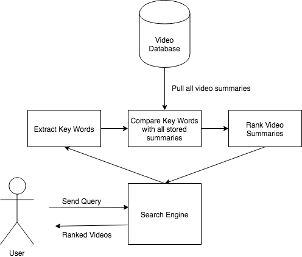
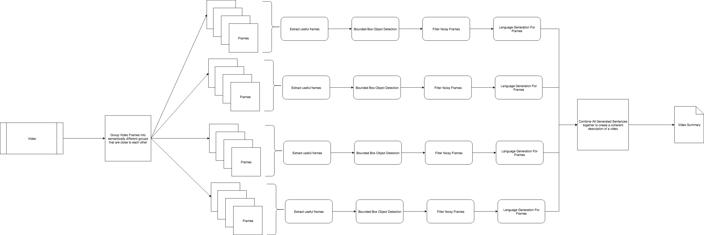

# Video Search Engine

Authors:

* [Abby Gray](inserturl.com)
* [Akshat Shrivastava](Github.com/AkshatSh)
* [Kevin Bi](https://github.com/kevinb22)
* [Sarah Yu](inserturl.com)

Semantically be able to search through a database of videos (using generated summaries)

## System Overview

The system described here is the overview of the overall system archietecture.



## Video Summarization Overview

Below is the initial architecture of the video summarization network used to generate video summaries.



## Set Up

To set up the python code create a python3 environment with the following:

```bash

# create a virtual environment
$ python3 -m venv env

# activate environment
$ source env/bin/activate

# install all requirements
$ pip install -r requirements.txt
```

If you add a new package you will have to update the requirements.txt with the following command:

```bash

# add new packages
$ pip freeze > requirements.txt
```

And if you want to deactivate the virtual environment

```bash

# decativate the virtual env
$ deactivate
```

## Plan

Our project will, broadly defined, be attempting video searching through video summarization. To do this we propose the following objectives and resulting action plan:

* Break videos down into semantically different groups of frames
* Recognize objects in an image (i.e. a frame)
* Convert a frame to text
* Merge summaries of all frames of a video into one large overall summary
* Build a search engine to query videos via summary.

## Goals

For our project, we have come up with a basic goal we plan to reach by the time of the presentation, and a stretch goal we hope to reach if time permits

**Basic Goal:** We will recognize objects through the [YOLO algorithm](https://pjreddie.com/darknet/yolo/). Convert each frame to text using the algorithm mentioned in this [paper](https://arxiv.org/abs/1707.07102). Come up with basic heuristic for skipping frames so not too much overlap in the summary. Surface all of this through a simple UI to search a video database.

**Stretch Goal:** Investigate other methods for reducing noise in frames (Generative Adversarial Networks), Investigate grouping together semantically similar frames to one common representation to make better summaries.

## Data Sets to Use

### [Common Object Data Set](http://cocodataset.org/#home)

Consists of labeled images for image captioning

### [Sum Me Data Set](https://people.ee.ethz.ch/~gyglim/vsum/)

Consists of action videos that can be used to test summaries.

### [MED Dataset](http://lear.inrialpes.fr/people/potapov/med_summaries)

The "MED Summaries" is a new dataset for evaluation of dynamic video summaries. It contains annotations of 160 videos: a validation set of 60 videos and a test set of 100 videos. There are 10 event categories in the test set.

## Citations

### Papers

* [Microsoft Research Paper on Video Summarization](https://arxiv.org/pdf/1704.01466.pdf)
* [YOLO Paper for bounding box object detection](https://pjreddie.com/media/files/papers/YOLO9000.pdf)
* [Using YOLO for image captioning](https://arxiv.org/abs/1707.07102)
* [Unsupervised Video Summarization with Adversarial Networks](http://web.engr.oregonstate.edu/~sinisa/research/publications/cvpr17_summarization.pdf)

### GitHubs

* [Original YOLO implementation](https://github.com/pjreddie/darknet)
* [Code for YOLO -> LSTM for image captioning](https://github.com/uvavision/obj2text-neuraltalk2)
* [YOLO PyTorch Implementation for Guidance](https://github.com/longcw/yolo2-pytorch)
* [Tiny YOLO Implementation] (https://github.com/marvis/pytorch-yolo2)
* [machinebox -> video analysis/frame partitioning](https://github.com/machinebox/videoanalysis)

### Blogs and Other Websites

* [A Guide for YOLO](https://www.kdnuggets.com/2018/05/implement-yolo-v3-object-detector-pytorch-part-1.html)
