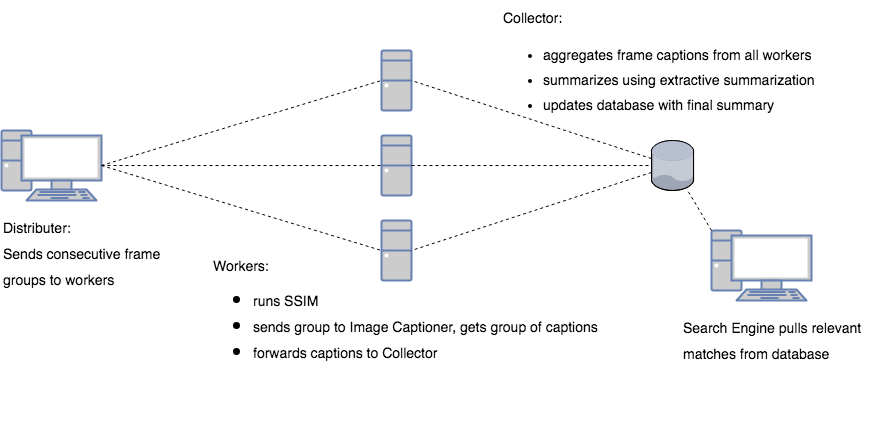
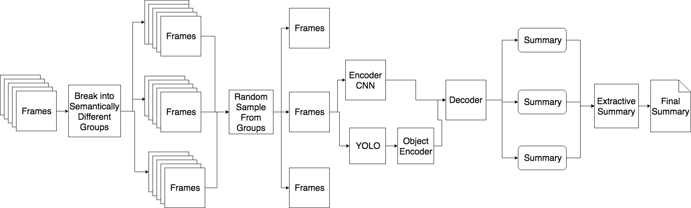

# Video Search Engine

Authors:

* [Abby Gray](https://github.com/abbygray)
* [Akshat Shrivastava](https://github.com/AkshatSh)
* [Kevin Bi](https://github.com/kevinb22)
* [Sarah Yu](https://github.com/sarahyu17)

Semantically be able to search through a database of videos (using generated summaries)

Take a look at our [poster](VideoSearchEnginePoster.pdf)

## Table of Contents

* [System Overview](#system-overview)
* [Video Summarization Overview](#video-summarization-overview)
* [Example output](#example-output)
* [User Interface](#user-interface)
* [Set Up](#set-up)
* [Training Captioning Network](#training-captioning-network)
* [Plan](#plan)
* [Data Sets](#data-sets-to-use)
* [Citations](#citations)

## System Overview

The video below shows exactly how the entire system works end to end.


The user facing system described here is the overview of the overall system architecture.


The backend and video summarizing system was distributed in an attempt to tackle large videos. The architecture is described in the image below




## Video Summarization Overview

In this project, we attempted to solve video summarizatoin using image captioning. The architecture and motivation is explained in this section.

Below is the initial architecture of the video summarization network used to generate video summaries.


We converted this into the following network for the final project



We can walk through the steps occuring with explantions here:

1. We break apart frames into semantically different groups.

    * Here we use `SSMI` (structured similarity measurment index) to determine if two frames are similar
    * We define a threshold for comparison
    * Any sequence of frames within that threshold belongs to a specific group.

2. Random Sample from each group
    * Since each group are all the semantically similar frames, to reduce the redundancies in the frame captions we try to remove similar frames by selecting a very small subset (1-5) frames from each group

3. Feed each selected frame to an image captioning network to determine what happens in the frame
    * This uses an Encoder-Decoder model for captioning the images as descibed in [Object2Text](https://arxiv.org/abs/1707.07102)
    * Model description
        * `Encoder`
            * `EncoderCNN`
                * Uses ResNet-152 pretrained to feed all the features to an encoded feature vector
            * `YoloEncoder`
                * From a frame performs bounding box object detection on the frame to determine the objects and the bounding boxes for all of them.
                * Uses RNN structure (LSTM for this model) to encode the sequence of objects and their names
                * Uses the resul to create another encoded feature vector
        * `Decoder`
            * Combines the two feature vectors from the `EncoderCNN` and the `YoloEncoder` to create a new feature vector, and uses that feature vector as input to start language generation for the frame caption
    * Training
        * **Dataset:** uses COCO for training
        * **Bounding Box:** during train uses `TinyYOLO` for faster training time as well as allowing the network to use a less reliable network to train on, and the more reliable version during testing
4. Uses `Extractive Summarization` to select unique phrases from all the frame captions seletected to create a reasonable description of what occured in the video.

The next section shows example output:

## Example output

Given a minute long video of traffic in Dhaka Bangladesh.

```
(
    'a man riding a bike down a street next to a large truck .',
    'a man riding a bike down a street next to a traffic light .',
    'a green truck with a lot of cars on it',
    'a green truck with a lot of cars on the road .',
    'a city bus driving down a street next to a traffic light .'
)
```

## User Interface

To use our search engine we built a `Flask` based application similar to google to search through our database.

### Main UI

This page features the main search functionality. A simplistic design similar to Google.


### Results UI

This page features all the results for a given query. Every video in our database is returned in sorted order for relevance. We use `TF-IDF` scoring for a query to a rank for each of the summaries.


## Set Up

To set up the python code create a python3 environment with the following:

```bash

# create a virtual environment
$ python3 -m venv env

# activate environment
$ source env/bin/activate

# install all requirements
$ pip install -r requirements.txt

# install data files
$ python dataloader.py
```

If you add a new package you will have to update the requirements.txt with the following command:

```bash

# add new packages
$ pip freeze > requirements.txt
```

And if you want to deactivate the virtual environment

```bash

# decativate the virtual env
$ deactivate
```

## Training Captioning Network

### Caption Network Set up

```bash
python VideoSearchEngine/ImageCaptioningNoYolo/resize.py --image_dir data/coco/train2014/ 
python VideoSearchEngine/ImageCaptioningNoYolo/resize.py --image_dir data/coco/val2014/ --output_dir data/val_resized2014
```

## Plan

Our project will, broadly defined, be attempting video searching through video summarization. To do this we propose the following objectives and resulting action plan:

* Break videos down into semantically different groups of frames
* Recognize objects in an image (i.e. a frame)
* Convert a frame to text
* Merge summaries of all frames of a video into one large overall summary
* Build a search engine to query videos via summary.

## Data Sets to Use

### [TaCos MulitModal Data Set](https://www.mpi-inf.mpg.de/departments/computer-vision-and-multimodal-computing/research/vision-and-language/tacos-multi-level-corpus/)

Lots of labeled data for text generation of video summaries.

[Paper](https://arxiv.org/pdf/1403.6173.pdf) about how data was collected and performance.

The location of the video dataset: [Source](https://www.mpi-inf.mpg.de/departments/computer-vision-and-multimodal-computing/research/human-activity-recognition/mpii-cooking-2-dataset/)

### [Common Object Data Set](http://cocodataset.org/#home)

Consists of labeled images for image captioning

### [Sum Me Data Set](https://people.ee.ethz.ch/~gyglim/vsum/)

Consists of action videos that can be used to test summaries.

### [MED Dataset](http://lear.inrialpes.fr/people/potapov/med_summaries)

The "MED Summaries" is a new dataset for evaluation of dynamic video summaries. It contains annotations of 160 videos: a validation set of 60 videos and a test set of 100 videos. There are 10 event categories in the test set.

## Citations

### Papers

* [Microsoft Research Paper on Video Summarization](https://arxiv.org/pdf/1704.01466.pdf)
* [YOLO Paper for bounding box object detection](https://pjreddie.com/media/files/papers/YOLO9000.pdf)
* [Using YOLO for image captioning](https://arxiv.org/abs/1707.07102)
* [Unsupervised Video Summarization with Adversarial Networks](http://web.engr.oregonstate.edu/~sinisa/research/publications/cvpr17_summarization.pdf)
* [Long-term Recurrent Convolutional Networks](https://arxiv.org/pdf/1411.4389.pdf)
* [Coherent Multi-Sentence Video Description with Variable Level of Detail](https://arxiv.org/pdf/1403.6173.pdf)

### GitHubs

* [Original YOLO implementation](https://github.com/pjreddie/darknet)
* [Code for YOLO -> LSTM for image captioning](https://github.com/uvavision/obj2text-neuraltalk2)
* [YOLO PyTorch Implementation for Guidance](https://github.com/longcw/yolo2-pytorch)
* [Tiny YOLO Implementation](https://github.com/marvis/pytorch-yolo2)
* [machinebox -> video analysis/frame partitioning](https://github.com/machinebox/videoanalysis)
* [Code to break video into frames](https://gist.github.com/keithweaver/70df4922fec74ea87405b83840b45d57)
* [Po-Hsun-Su/pytorch-ssim](https://github.com/Po-Hsun-Su/pytorch-ssim)

### Blogs and Other Websites

* [A Guide for YOLO](https://www.kdnuggets.com/2018/05/implement-yolo-v3-object-detector-pytorch-part-1.html)
* [Another YOLO Guide (same author as above)](https://blog.paperspace.com/how-to-implement-a-yolo-object-detector-in-pytorch/)
